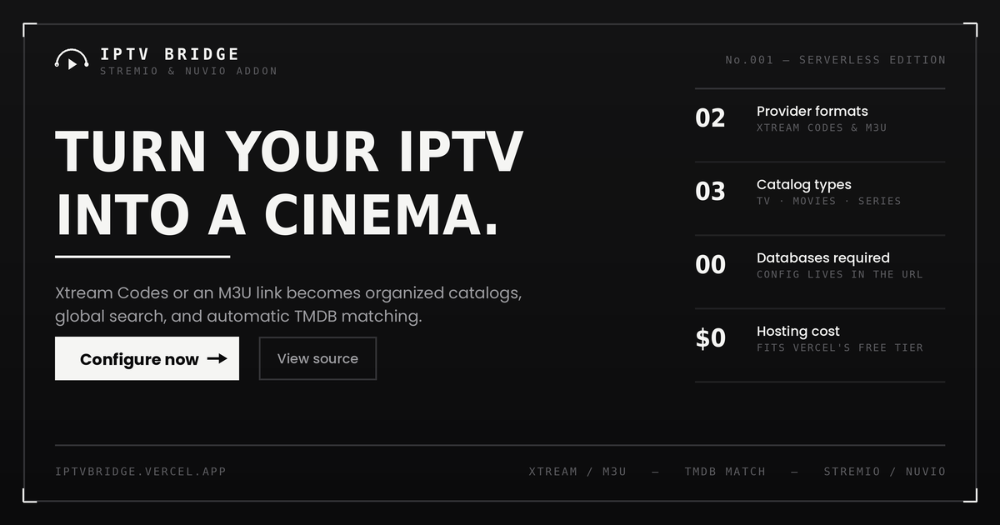

# IPTV Bridge
<p align="center">
  
</p>

**Cinema for your Stremio & Nuvio.**
Connect your own Xtream Codes account or M3U playlist and turn it into organized catalogs, global search, and automatic TMDB matching — every film and show resolves straight to your own IPTV sources.

Runs on the global edge (Cloudflare Workers), so it's fast everywhere with no cold starts. No database, no always-on server, and your credentials never leave your personal addon link.

---

## Table of contents

- [Features](#features)
- [How it works](#how-it-works)
- [Where are my categories?](#where-are-my-categories)
- [Configuration model](#configuration-model)
- [Addon endpoints](#addon-endpoints)
- [Local development](#local-development)
- [Deploying](#deploying)
- [Installing in Stremio & Nuvio](#installing-in-stremio--nuvio)
- [Performance](#performance)
- [Privacy & security](#privacy--security)
- [License](#license)

---

## Features

- **Two provider formats** — Xtream Codes API and plain M3U / M3U8 playlists.
- **Bring your own account** — each user plugs in their own credentials; nothing is shared between users.
- **Clean catalogs** — Live TV, Movies and Series as three tidy Stremio/Nuvio catalogs.
- **Categories as a genre filter** — all your provider categories show up as a dropdown inside each catalog (see below).
- **Global search** — search any title in the player; matching streams come from your own provider.
- **TMDB matching** — posters, ratings, years, and IMDB/TMDB ID resolution.
- **Fuzzy title matcher** — strips release tags/quality/season markers and ranks candidates with year and episode guards.
- **Branded configurator** — an animated web UI to build and install your addon in three steps.

---

## How it works

```
Xtream / M3U  ─▶  Parse + Clean + Cache  ─▶  TMDB Resolver  ─▶  Fuzzy Matcher  ─▶  Stremio / Nuvio
```

1. **Connect** — you enter Xtream credentials or an M3U URL in the configurator. Your channels, movies and series are read once and cached at the edge for fast browsing.
2. **Resolve** — when the player opens a title (by IMDB `tt…` or `tmdb:…` id), TMDB supplies the canonical name/year/artwork. These lookups are cached and shared, so popular titles resolve instantly.
3. **Stream** — the matcher scores your IPTV items against the resolved title (with year/season/episode guards) and returns ranked, playable stream URLs from your own account.

---

## Where are my categories?

Your IPTV provider can expose hundreds of categories (e.g. "Sports", "UK Movies", "Kids"). Instead of turning each one into a separate catalog and cluttering your home screen, **all of your categories live inside a genre dropdown on each catalog**:

- Open **Live**, **Movies** or **Series** (Discover / Board / Catalogs, depending on the app).
- Use the catalog's **Genre** filter (the dropdown at the top of the catalog view).
- The options in that dropdown are your provider's own category names. Pick one to see only the channels or titles in that category.

So there are only three catalogs (Live / Movies / Series), and every provider category is reachable through the **Genre** filter within them. The categories shown are read live from *your* account, so they match exactly what your provider offers. You can also narrow which categories are included when you build your link in the configurator.

Global search works across everything regardless of the selected genre.

---

## Configuration model

The configurator builds a `UserConfig` object and compresses it into your addon link:

```ts
interface UserConfig {
  type: 'xtream' | 'm3u';
  host?: string;          // Xtream server URL
  username?: string;      // Xtream username
  password?: string;      // Xtream password
  m3uUrl?: string;        // M3U playlist URL
  tmdbApiKey?: string;    // TMDB v3 API key (optional)
  includedCategories?: string[];
  includeLive?: boolean;
  includeMovies?: boolean;
  includeSeries?: boolean;
  streamType?: 'm3u8' | 'ts' | 'auto';
}
```

The config is URL-safe compressed, so your personal manifest looks like:

```
https://<your-domain>/<compressed-config>/manifest.json
```

Your credentials live only inside this link — they are decoded per request and never stored on the server.

---

## Addon endpoints

| Method | Path | Purpose |
| --- | --- | --- |
| `GET` | `/` | Landing page |
| `GET` | `/configure` | Build wizard |
| `POST` | `/api/test-connection` | Validate provider + TMDB key, return categories |
| `GET` | `/<config>/manifest.json` | Addon manifest (catalogs, types, resources) |
| `GET` | `/<config>/catalog/:type/:id.json` | Browse a catalog (supports `search=`, `genre=`, `skip=`) |
| `GET` | `/<config>/meta/:type/:id.json` | Metadata for an item (TMDB-enriched) |
| `GET` | `/<config>/stream/:type/:id.json` | Resolve playable IPTV streams for a title |

`:type` is one of `tv`, `movie`, `series`. IDs may be IMDB (`tt…`), TMDB (`tmdb:…`) or internal (`iptv:…`).

---

## Local development

```bash
cd worker
npm install
npm run dev        # wrangler dev (local edge runtime)
```

Open the local URL wrangler prints, then `/configure` to build a link.

---

## Deploying

```bash
cd worker
npm run typecheck
npm run deploy     # wrangler deploy
```

No secrets are required — the optional TMDB key is entered per-user in the configurator (or a shared fallback key is used).

The repo-root `vercel.json` keeps the legacy `iptvbridge.vercel.app` domain working by forwarding every request to the deployed Worker, so existing users never have to reinstall. Point it at your Worker URL and redeploy the Vercel project.

---

## Installing in Stremio & Nuvio

- **Stremio (one click):** the wizard produces a `stremio://…/manifest.json` link — click **Install to Stremio**.
- **Stremio Web / Nuvio:** copy the `https://…/manifest.json` URL and paste it into the add-addon field.

---

## Performance

- **Edge everywhere** — served from the nearest Cloudflare location, no cold starts.
- **Cached provider data** — your channel/movie/series lists are cached after the first load for fast browsing.
- **Shared TMDB cache** — title lookups are cached and reused, so posters and matches load quickly.
- **De-duplication** — simultaneous identical requests collapse into a single upstream fetch.

---

## Privacy & security

- Credentials are **never stored** — they live only inside the compressed addon link you generate and hold.
- Treat your addon link like a password: anyone with it can use your IPTV subscription.
- The web configurator validates connections through `POST /api/test-connection`; nothing is persisted.

---

## License

MIT. See [`LICENSE`](LICENSE). This project is a technical bridge; you are responsible for the legality of any IPTV source you connect.
